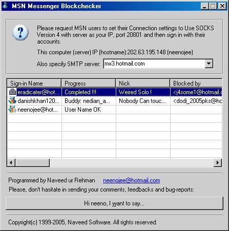



## MSN Messenger 6\.x Blockchecker \(server like app\.\) \- Autoemail blocklist to user after the job \!\!\!

### Description

Lets easily impress your friends or raise up the traffic at your site !!! I think, the title is enough to explain my project. Well, just a few more things to say that ... I have tested it with MSN 6.x and I got 100% results. This application works as a server on your computer. The project needs no more code updating, just compile it, put it on your server machine and run it ! Even just run it for a few minutes and provide services to your friends (Even if you are using a lazy internet service like me - ewww) Readme included.

SMTP servers are also given so don't worry about this. Oh yeh, send comments and don't forget to VOTE ME.
 
### More Info
 

             |
---                |---
**Submitted On**   |2005-01-03 17:23:02
**By**             |[Naveed ur Rahman](https://github.com/Planet-Source-Code/PSCIndex/blob/master/ByAuthor/naveed-ur-rahman.md)
**Level**          |Advanced
**User Rating**    |5.0 (10 globes from 2 users)
**Compatibility**  |VB 6\.0
**Category**       |[Coding Standards](https://github.com/Planet-Source-Code/PSCIndex/blob/master/ByCategory/coding-standards__1-43.md)
**World**          |[Visual Basic](https://github.com/Planet-Source-Code/PSCIndex/blob/master/ByWorld/visual-basic.md)
**Archive File**   |[MSN\_Messen183625132005\.zip](https://github.com/Planet-Source-Code/naveed-ur-rahman-msn-messenger-6-x-blockchecker-server-like-app-autoemail-blocklist-to-use__1-58088/archive/master.zip)

